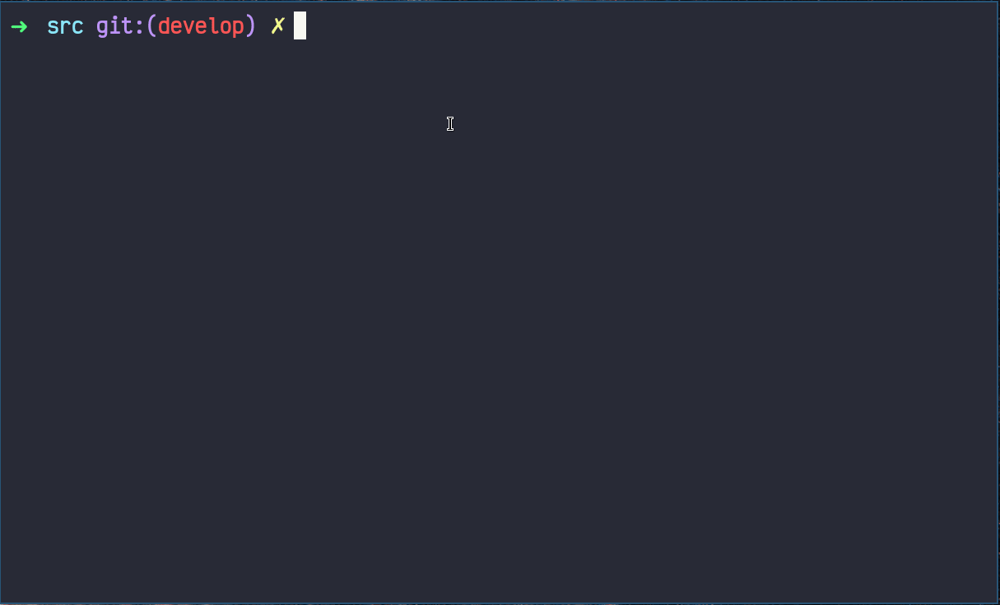

# Matrix Library

### Table of Contents
* [Introduction](#introduction)
* [Goals](#goals)
* [Build](#build)
* [Tests](#tests)

### Introduction

Implementation of simple matrix processing routines
- Creating a matrix with required sizes
- Removing a matrix
- Comparing matrices
- Sum of matrices
- Subtraction of matrices
- Multiplication of matrices
- Transpose of a matrix
- Determinant of a matrix
- Inverse of a matrix
- Complements matrix

### Goals
- Learn matrix operations and implementations
- Get better at working with memory in C
- Improve Makefile
- Implement tests for the library
- Become familiar with other matrix libraries such as [GSL](https://www.gnu.org/software/gsl/doc/html/index.html)<br>(Have tried while testing, turned out to be quite complex :O)

### Build

```
$ git clone git.github.com:bezlant/s21_matrix_routins.git
$ cd s21_matrix_routins/src
$ make
```

### Tests
* Unit tests are implemented using [Check](https://libcheck.github.io/check/) & coverage report with [LCOV](https://github.com/linux-test-project/lcov)


